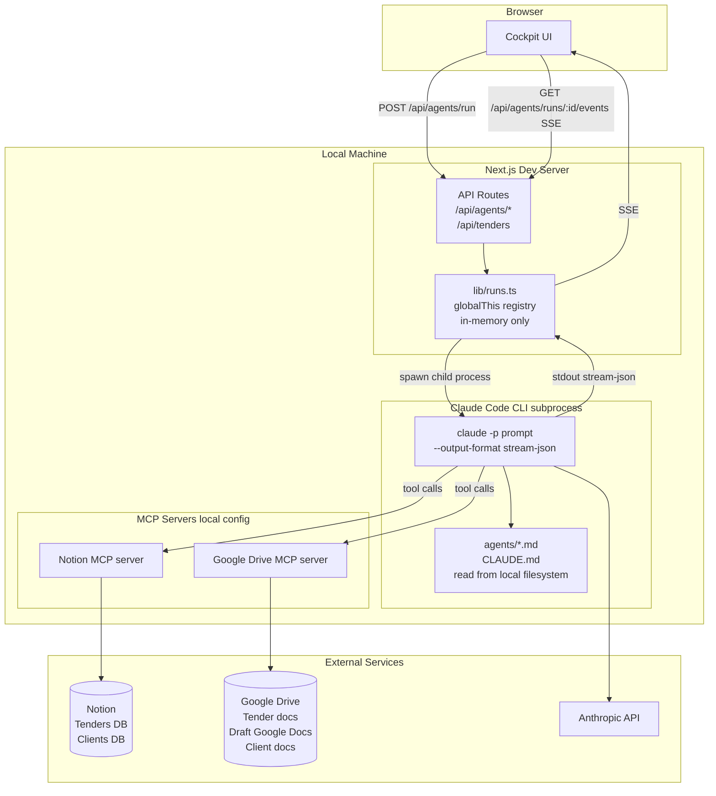
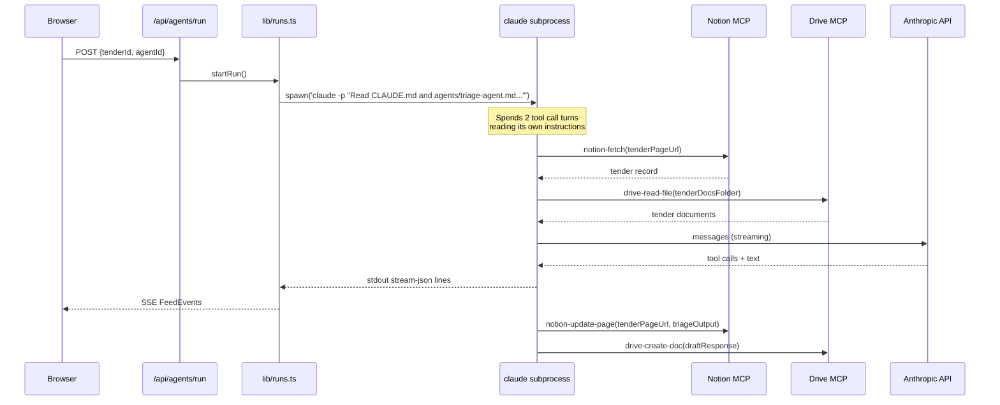
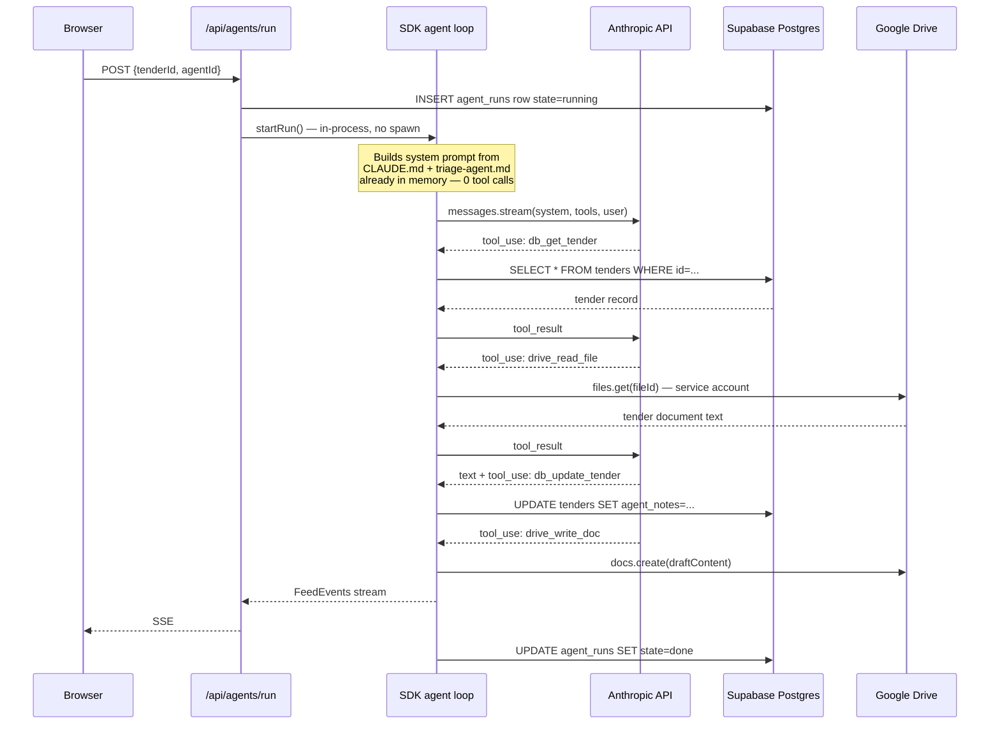

# TenderEngine — Architecture Migration Plan

## Current State

### What's happening today

The cockpit runs as a local Next.js dev server. When an agent run is triggered,
the server spawns `claude -p` as a child process — the full Claude Code CLI
binary — and passes it a prompt string instructing it to read its own instruction
files from the local filesystem. The CLI then connects to two MCP servers
(Notion and Google Drive) that are configured in the local Claude Code config,
and uses those to read and write all data. Agent output streams back over
stdout as newline-delimited JSON, which the server parses and forwards to the
browser via SSE. Run state lives in `globalThis` — it is lost the moment the
process restarts.

The system has no independent database. Notion is both the source of truth for
tender and client records and the UI for manual data entry. Google Drive holds
every document.

```
Cannot be deployed — subprocess model requires local Claude Code install
and MCP config. Run state is ephemeral. No auth layer.
```

### Current architecture diagram



### Current data flow — agent run



### Current environment

| Variable | Purpose |
|---|---|
| `NOTION_TOKEN` | Notion integration token |
| `CLAUDE_BIN` | Path to claude binary (defaults to `claude`) |
| `TENDER_ENGINE_ROOT` | Root dir for agent .md files |

No deployment config exists. Everything runs on a single developer machine.

---

## Target State

### What changes

| Layer | Before | After |
|---|---|---|
| **Hosting** | Local dev server | Railway (single service) |
| **Agent execution** | `spawn('claude -p ...')` subprocess | In-process Anthropic SDK agent loop |
| **Agent instructions** | Agent reads its own .md files via tool calls | .md files pre-loaded as system prompt — no wasted turns |
| **Structured data** | Notion (tenders, clients) | Supabase Postgres |
| **Run state** | `globalThis` in-memory | Supabase `agent_runs` table |
| **MCP servers** | Notion MCP + Drive MCP (local config) | Direct tool handlers: Supabase JS + googleapis |
| **Document storage** | Google Drive (via Drive MCP) | Google Drive (via googleapis service account) — unchanged |
| **Client editing** | Google Docs shared link | Google Docs shared link — unchanged |

### What stays the same

- Google Drive folder structure
- Google Docs as the output format clients edit
- SSE transport for live agent events to the browser
- All UI components and route handler signatures
- Agent `.md` instruction files (content unchanged, just loaded differently)

### Target architecture diagram

```mermaid
graph TD
    subgraph Browser
        UI[Cockpit UI]
    end

    subgraph Railway — single service
        subgraph Next.js App
            ROUTES[API Routes\n/api/agents/*\n/api/tenders\n/api/clients]
        end

        subgraph SDK Agent Loop in-process
            LOOP[Anthropic SDK\nagent loop]
            SYS[System prompt builder\nCLAUDE.md + agentId-agent.md\nbundled in container]
            LOOP --> SYS
        end

        subgraph Tool Handlers
            DBTOOL[Supabase tools\ndb_get_tender\ndb_update_tender\ndb_get_client\ndb_update_client]
            DRIVETOOL[Drive tools\ndrive_list_files\ndrive_read_file\ndrive_write_doc\ndrive_read_doc]
        end

        ROUTES -- in-process call --> LOOP
        LOOP -- tool dispatch --> DBTOOL
        LOOP -- tool dispatch --> DRIVETOOL
        LOOP -- FeedEvents --> ROUTES
        ROUTES -- SSE --> UI
    end

    subgraph Supabase
        PG[(Postgres\ntenders\nclients\nagent_runs)]
    end

    subgraph Google Drive
        TDOCS[Tender documents\noriginal PDFs / DOCX]
        DRAFTS[Draft Google Docs\nclient edits here]
        CDOCS[Client documents\ninsurance / refs]
    end

    DBTOOL --> PG
    DRIVETOOL --> TDOCS
    DRIVETOOL --> DRAFTS
    DRIVETOOL --> CDOCS

    subgraph Anthropic
        API[claude-sonnet-4-6\nstreaming messages API]
    end

    LOOP --> API

    UI -- POST /api/agents/run --> ROUTES
    UI -- GET /api/agents/runs/:id/events SSE --> ROUTES
    UI -- GET /api/tenders --> ROUTES
```

### Target data flow — agent run



### Supabase schema

```sql
CREATE TABLE clients (
  id            UUID PRIMARY KEY DEFAULT gen_random_uuid(),
  company_name  TEXT NOT NULL,
  trading_name  TEXT,
  abn           TEXT,
  acn           TEXT,
  contact_name  TEXT,
  contact_email TEXT,
  contact_phone TEXT,
  drive_folder  TEXT,                      -- Google Drive folder URL
  profile_status TEXT DEFAULT 'Incomplete',
  sectors       TEXT[],
  items_missing INT DEFAULT 0,
  docs_reviewed INT DEFAULT 0,
  created_at    TIMESTAMPTZ DEFAULT now(),
  updated_at    TIMESTAMPTZ DEFAULT now()
);

CREATE TABLE tenders (
  id                UUID PRIMARY KEY DEFAULT gen_random_uuid(),
  reference         TEXT,
  name              TEXT NOT NULL,
  client_id         UUID REFERENCES clients(id),
  deadline          DATE,
  decision_date     DATE,
  status            TEXT DEFAULT 'New',
  priority          TEXT DEFAULT 'Normal',
  result            TEXT,
  submission_method TEXT,
  owner             TEXT,
  output_doc        TEXT,                  -- Google Drive URL to draft Google Doc
  tender_docs       TEXT,                  -- Google Drive folder URL
  sections_found    INT DEFAULT 0,
  sections_mapped   INT DEFAULT 0,
  sections_drafted  INT DEFAULT 0,
  gaps_found        INT DEFAULT 0,
  blockers          TEXT DEFAULT '',
  compliance_flags  TEXT DEFAULT '',
  estimated_value   TEXT DEFAULT '',
  next_action       TEXT DEFAULT '',
  agent_notes       TEXT DEFAULT '',
  created_at        TIMESTAMPTZ DEFAULT now(),
  updated_at        TIMESTAMPTZ DEFAULT now()
);

CREATE TABLE agent_runs (
  id          UUID PRIMARY KEY DEFAULT gen_random_uuid(),
  tender_id   UUID REFERENCES tenders(id),
  agent_id    TEXT NOT NULL,
  prompt      TEXT,
  started_at  TIMESTAMPTZ DEFAULT now(),
  finished_at TIMESTAMPTZ,
  state       TEXT DEFAULT 'running',   -- running | done | error | cancelled
  events      JSONB DEFAULT '[]',       -- FeedEvent[]
  exit_code   INT
);

-- Row-level indexing for the cockpit rail and run polling
CREATE INDEX ON tenders (status, deadline);
CREATE INDEX ON agent_runs (tender_id, started_at DESC);
```

### Tool handler signatures

These are the functions that back each SDK tool the agents can call.
Implemented in `lib/tools/` — one file per domain.

```
lib/tools/
  supabase.ts     db_get_tender · db_update_tender · db_get_client · db_update_client
  drive.ts        drive_list_files · drive_read_file · drive_write_doc · drive_read_doc
  index.ts        exports TOOLS array (Anthropic.Tool[]) + dispatch(toolName, input)
```

### Target environment variables

| Variable | Purpose |
|---|---|
| `ANTHROPIC_API_KEY` | Anthropic API — agent execution |
| `SUPABASE_URL` | Supabase project URL |
| `SUPABASE_SERVICE_ROLE_KEY` | Supabase service role — full DB access |
| `GOOGLE_SERVICE_ACCOUNT_JSON` | Full service account JSON blob — Drive access |
| `TENDER_ENGINE_ROOT` | Path to agent .md files in container (optional — defaults to `../` from cwd) |

Removed: `NOTION_TOKEN`, `CLAUDE_BIN`

---

## Migration Phases

### Phase 1 — Supabase (replace Notion as data layer)

**Goal:** cockpit reads/writes Supabase instead of Notion. No agent changes yet.

```
1a. Create Supabase project. Run schema above.
1b. Write migration script: pull all Notion records via API, insert into Supabase.
1c. Replace /api/tenders/route.ts — query Supabase instead of Notion.
1d. Add /api/clients/route.ts — new endpoint backed by Supabase.
1e. Swap @notionhq/client → @supabase/supabase-js in package.json.
1f. Add SUPABASE_URL + SUPABASE_SERVICE_ROLE_KEY to .env.local.
1g. Verify cockpit loads live data from Supabase.
```

Agents still run via subprocess at this point. Notion MCP still works for them
during the transition — the cockpit and agents temporarily use different sources.
That's fine for one sprint.

### Phase 2 — SDK agent loop (replace subprocess)

**Goal:** agents run in-process via Anthropic SDK. No Claude Code CLI dependency.

```
2a. Add @anthropic-ai/sdk to package.json.
2b. Implement lib/tools/supabase.ts — 4 tool handlers backed by supabase-js.
2c. Implement lib/tools/drive.ts — 4 tool handlers backed by googleapis.
2d. Add GOOGLE_SERVICE_ACCOUNT_JSON to env. Share TenderEngine Drive folder
    with service account email.
2e. Rewrite lib/runs.ts startRun() — replace spawn() with SDK agent loop.
    System prompt = readFileSync(CLAUDE.md) + readFileSync(agents/{id}-agent.md).
    Tool dispatch routes tool_use blocks to lib/tools/index.ts.
2f. Persist run events to Supabase agent_runs table (replace globalThis registry).
2g. Update agent .md files — add a short tool manifest at the top of each
    listing the available tool names and their signatures.
2h. Test each agent end-to-end locally.
```

### Phase 3 — Railway deployment

**Goal:** running in production, zero local dependencies.

```
3a. Add railway.json pointing root to tenderengine-cockpit/.
3b. Confirm Nixpacks picks up Node 20 + npm build correctly.
3c. Set all five env vars in Railway dashboard.
3d. Set TENDER_ENGINE_ROOT to the absolute container path of the agents/ dir
    (or bundle agents/ into tenderengine-cockpit/ and remove the env var).
3e. Deploy. Smoke test: create tender in cockpit, run triage, confirm
    Supabase row updated and Google Doc created in Drive.
3f. Point domain at Railway service.
```

### Phase 4 — Hardening (post-launch)

```
- Auth: add a simple shared secret or Supabase Auth (magic link) so the
  cockpit isn't open to the internet.
- Run history: surface past agent_runs per tender in the cockpit UI.
- Rate limiting: one active run per tender at a time (enforce in /api/agents/run).
- Alerts: Railway health check on /api/health. Notify on agent error state.
```

---

## Risk register

| Risk | Likelihood | Impact | Mitigation |
|---|---|---|---|
| Google Drive service account permissions wrong | Medium | High | Test Drive read/write locally before Phase 3 |
| Agent .md tool names don't match SDK tool names | Medium | Medium | Audit tool names in each .md file before Phase 2g |
| SSE drops behind Railway's proxy | Low | Medium | Add `X-Accel-Buffering: no` header (already present) |
| Agent runs too long, Railway 60s timeout | Low | High | Railway supports long-lived HTTP — confirm timeout config |
| Notion → Supabase data migration gaps | Low | Low | Run migration twice (dry run + live), validate row counts |
