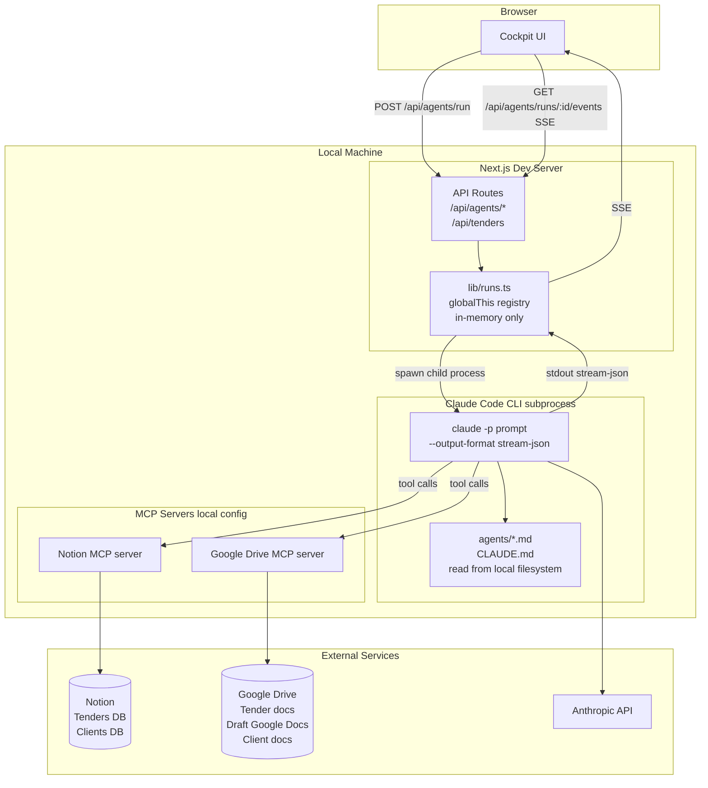
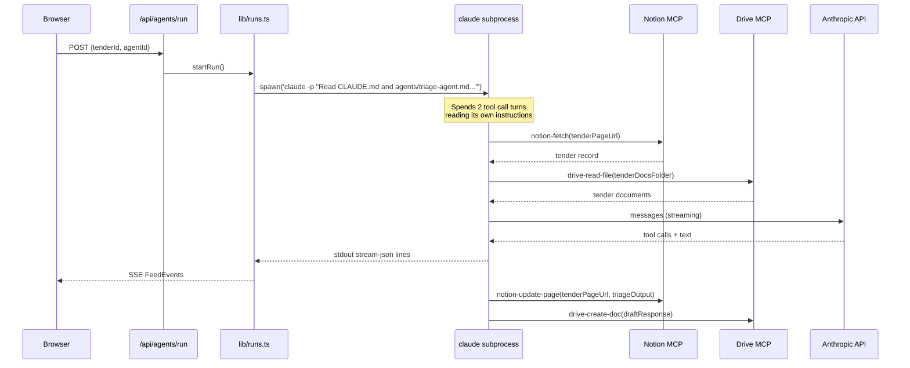
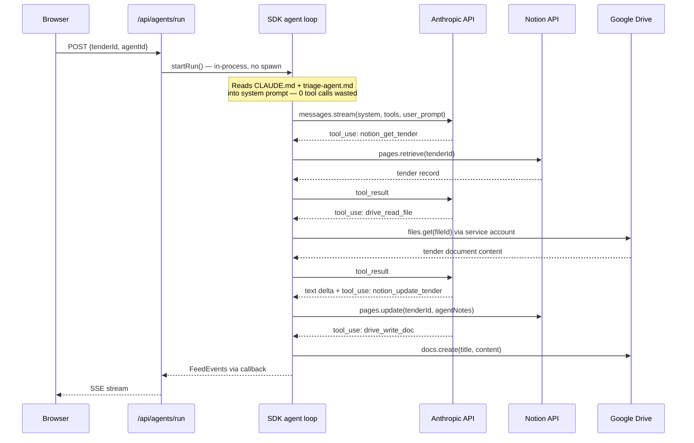

# TenderEngine — Migration Plan

## What this document is

A full record of the architecture decisions made and the plan to execute them.
The active initiative is replacing the Claude Code CLI subprocess with the
Anthropic SDK so the system can run on Railway without any local dependencies,
while keeping Notion as the data layer and Google Drive for document storage.

A Supabase migration was scoped and designed (see Parked Phases below) but is
deferred — Notion's UI is actively used for work beyond what the cockpit
surfaces, and cutting over now would remove that visibility before the cockpit
is ready to replace it.

---

## Where we are now

### The problem with the current setup

The cockpit runs as a local Next.js dev server. When an agent run is triggered,
the server spawns `claude -p` as a child process — the full Claude Code CLI
binary — and passes it a prompt string that tells it to read its own instruction
files from the local filesystem. The CLI connects to two MCP servers (Notion and
Google Drive) that are configured in the local `~/.claude` config, uses those
to read and write all data, and streams output back over stdout as
newline-delimited JSON. The server parses that stream and pushes events to the
browser over SSE.

This means:

- **Cannot be deployed.** The subprocess model requires the Claude Code binary
  installed locally, plus MCP config pointing at Notion and Drive. Railway has
  neither.
- **Run state is ephemeral.** Everything lives in `globalThis.__teRunRegistry`.
  A server restart wipes every in-flight and completed run.
- **Notion is both the database and the UI.** There is no independent data
  layer. All structured tender and client data lives in Notion. Notion's API is
  slow, rate-limited, and the property model is awkward to query.
- **The agent wastes turns reading its own instructions.** The prompt says
  "Read CLAUDE.md and agents/triage-agent.md" — so the agent spends two tool
  call roundtrips fetching its own instruction files before it does any real
  work. That costs tokens and time on every run.

### Current architecture



### Current agent run — sequence



### Current environment variables

| Variable | Purpose |
|---|---|
| `NOTION_TOKEN` | Notion integration token |
| `CLAUDE_BIN` | Path to claude binary (defaults to `claude` on PATH) |
| `TENDER_ENGINE_ROOT` | Root dir for agent .md files |

---

## The decisions we made

### 1. Keep Notion as the data layer (for now)

Notion stays as the source of truth for tenders and clients. The Notion UI
is actively used for work that the cockpit does not yet surface — manual
status updates, notes, linking, and visibility across the team. Cutting over
to a new database before the cockpit is ready to replace that workflow would
create a blind spot.

The cockpit's `/api/tenders` route already reads from Notion when
`NOTION_TOKEN` is set. That stays as-is. A Supabase migration has been fully
designed and is parked for a later phase — see Parked Phases at the bottom of
this document.

### 2. Keep Google Drive for document storage

Google Drive was considered for replacement — Supabase Storage was evaluated
as an alternative. We decided to keep Drive because:

- The clients this system serves are non-technical. They already know how to
  open a Google Doc, leave a comment, and make a tracked edit.
- Draft responses are produced as Google Docs. Clients open the shared link,
  edit inline, and return feedback without needing any new tool or workflow.
- Switching to Supabase Storage would mean storing drafts as Markdown or DOCX
  files and building or integrating a document editor — a significant scope
  increase with no user benefit.

The Drive integration changes from MCP (local config) to a Google service
account with the `googleapis` npm package. The folder structure and file URLs
stay identical. Nothing changes for clients.

### 3. Replace the Claude Code CLI subprocess with the Anthropic SDK agent loop (active)

The `spawn('claude -p ...')` call in `lib/runs.ts` is replaced with an
in-process agentic loop using `@anthropic-ai/sdk`. The loop:

1. Reads the relevant `.md` files and builds a system prompt before the first
   API call — no tool turns wasted reading instructions.
2. Calls `anthropic.messages.stream()` with a defined set of tools.
3. Executes tool calls server-side (Supabase queries, Drive API calls).
4. Sends tool results back to the API and loops until `stop_reason: end_turn`.
5. Converts streaming output into the same `FeedEvent` shape the existing SSE
   endpoint emits.

The UI, SSE layer, and all route handler signatures stay unchanged. Only the
internals of `startRun()` change.

**Why the agent .md files do not need to be rewritten:**
The `.md` files are system prompts, not discovered plugins. Loaded before
the first API call, they become the `system` parameter. The agent instructions
themselves are unchanged — only the tool names referenced in them need a short
preamble mapping them to the SDK tool names we define.

### 4. Deploy to Railway

Single Next.js service on Railway. No separate backend process. The SDK agent
loop runs inside the Next.js API route handler — same process, no subprocess,
no inter-process communication needed. Railway's Node.js runtime handles
long-running HTTP connections (SSE) without special configuration beyond
confirming the timeout is set appropriately.

---

## Target state

### What changes

| Layer | Before | After |
|---|---|---|
| Hosting | Local dev server | Railway |
| Agent execution | `spawn('claude -p ...')` subprocess | In-process Anthropic SDK agent loop |
| Agent instructions | Agent reads .md files via tool calls | .md files pre-loaded as system prompt |
| MCP servers | Notion MCP + Drive MCP (local config) | Notion JS client + googleapis (in-process) |
| Document storage | Google Drive via Drive MCP | Google Drive via service account |

### What stays the same

- Notion as the data layer for tenders and clients
- Google Drive folder structure
- Google Docs as the output format clients edit and review
- SSE transport for live agent events
- All UI components and cockpit route handler signatures
- Agent `.md` instruction file content (unchanged, just loaded differently)
- The `Tender` and `Client` TypeScript types in `lib/types.ts`

### Target architecture

```mermaid
graph TD
    subgraph Browser
        UI[Cockpit UI]
    end

    subgraph Railway — single service
        subgraph Next.js App
            ROUTES[API Routes\n/api/agents/*\n/api/tenders]
        end

        subgraph SDK Agent Loop in-process
            LOOP[Anthropic SDK\nmessages.stream]
            SYS[System prompt builder\nCLAUDE.md + agentId-agent.md\nbundled in container]
            LOOP --> SYS
        end

        subgraph Tool Handlers lib/tools
            NOTIONTOOL[Notion tools\nnotion_get_tender\nnotion_update_tender\nnotion_get_client\nnotion_update_client]
            DRIVETOOL[Drive tools\ndrive_list_files\ndrive_read_file\ndrive_write_doc\ndrive_read_doc]
        end

        ROUTES -- in-process call --> LOOP
        LOOP -- tool dispatch --> NOTIONTOOL
        LOOP -- tool dispatch --> DRIVETOOL
        LOOP -- FeedEvents --> ROUTES
        ROUTES -- SSE --> UI
    end

    subgraph Notion
        NDB[(Notion\nTenders DB\nClients DB)]
    end

    subgraph Google Drive
        TDOCS[Tender documents\noriginal PDFs and DOCX]
        DRAFTS[Draft Google Docs\nclient edits here]
        CDOCS[Client documents\ninsurance and references]
    end

    subgraph Anthropic
        API[claude-sonnet-4-6\nstreaming messages API]
    end

    NOTIONTOOL --> NDB
    DRIVETOOL --> TDOCS
    DRIVETOOL --> DRAFTS
    DRIVETOOL --> CDOCS
    LOOP --> API

    UI -- POST /api/agents/run --> ROUTES
    UI -- GET /api/agents/runs/:id/events SSE --> ROUTES
    UI -- GET /api/tenders --> ROUTES
```

### Target agent run — sequence



---

---

## SDK agent loop — how the instruction files work

### The current problem

The prompt today is literally: `"Read CLAUDE.md and agents/triage-agent.md. Run triage on [URL]"`

The agent's first two actions are always reading its own instructions. That is
two tool call roundtrips — one to read `CLAUDE.md`, one to read the agent file
— before any real work begins. This costs tokens and adds latency on every run.

### The fix

With the SDK, the `system` parameter is passed directly in the API call.
The server reads the files before initiating the conversation:

```typescript
import Anthropic from "@anthropic-ai/sdk";
import fs from "node:fs";
import path from "node:path";

const agentRoot = process.env.TENDER_ENGINE_ROOT
  ?? path.resolve(process.cwd(), "..");

function buildSystemPrompt(agentId: AgentId): string {
  const claudeMd = fs.readFileSync(
    path.join(agentRoot, "CLAUDE.md"), "utf-8"
  );
  const agentMd = fs.readFileSync(
    path.join(agentRoot, "agents", `${agentId}-agent.md`), "utf-8"
  );
  return `${claudeMd}\n\n---\n\n${agentMd}`;
}
```

The user message is then just the operational prompt:
`"Run triage on https://notion.so/..."`

The agent starts triage work immediately. The instruction files are already in
context.

### How the agent .md files are deployed

The `agents/` directory and `CLAUDE.md` live at the root of the repository.
`tenderengine-cockpit/` is one level down. On Railway, the whole repo is
cloned into the container. `TENDER_ENGINE_ROOT` defaults to
`path.resolve(process.cwd(), "..")` — which is already the correct path when
the Next.js server runs from `tenderengine-cockpit/`. No changes to the file
structure needed.

---

## Tool handler design

The agents interact with the outside world through a defined set of SDK tools.
These replace the Notion MCP and Drive MCP tools the CLI used.

### File structure

```
tenderengine-cockpit/lib/tools/
  supabase.ts     — Supabase tool handlers
  drive.ts        — Google Drive tool handlers
  index.ts        — TOOLS array + dispatch function
```

### Tool definitions

```typescript
// Notion tools — same data, direct API instead of MCP
{ name: "notion_get_tender",    description: "Read a tender page from Notion by page ID." }
{ name: "notion_update_tender", description: "Update properties on a Notion tender page." }
{ name: "notion_get_client",    description: "Read a client page from Notion by page ID." }
{ name: "notion_update_client", description: "Update properties on a Notion client page." }

// Google Drive tools — same capability as Drive MCP, different implementation
{ name: "drive_list_files", description: "List files in a Google Drive folder." }
{ name: "drive_read_file",  description: "Read the text content of a file in Google Drive." }
{ name: "drive_write_doc",  description: "Create or overwrite a Google Doc in a Drive folder." }
{ name: "drive_read_doc",   description: "Read the text content of a Google Doc including any edits." }
```

### Agent .md files — tool name alignment

The agent `.md` files currently reference Notion MCP tool names
(`notion-fetch`, `notion-update-page`) and Drive MCP tool names
(`drive-read-file`, `drive-create-doc`). These are close to the SDK tool names
above — a search-and-replace in each file maps them across. One-time, mechanical.

---

## Target environment variables

| Variable | Purpose |
|---|---|
| `ANTHROPIC_API_KEY` | Anthropic API — agent execution and chat |
| `NOTION_TOKEN` | Notion integration token — unchanged |
| `GOOGLE_SERVICE_ACCOUNT_JSON` | Full service account JSON as a single env var |
| `TENDER_ENGINE_ROOT` | Optional — path to agents/ dir in container |

Removed: `CLAUDE_BIN`

---

## Google Drive service account setup

The Drive MCP today runs with your personal Google credentials configured
locally. On Railway this is replaced by a service account:

1. Create a service account in Google Cloud Console under the project that
   has Drive API enabled.
2. Download the JSON key file.
3. Share the `TenderEngine/` top-level Drive folder with the service account's
   email address (looks like `name@project.iam.gserviceaccount.com`).
   Give it Editor access.
4. Paste the entire JSON key file content as the `GOOGLE_SERVICE_ACCOUNT_JSON`
   env var in Railway.

The `googleapis` npm package handles authentication from there. The service
account can read and write any file in the shared folder tree.

---

## Migration phases

### Phase 1 — Replace subprocess with SDK agent loop

Goal: agents run in-process via the Anthropic SDK. No Claude Code CLI required.
Notion and Drive integrations move from MCP to direct API calls. NOTION_TOKEN stays.

```
1a  Add dependencies.
    npm install @anthropic-ai/sdk googleapis

1b  Implement lib/tools/notion.ts.
    Four functions: getTender, updateTender, getClient, updateClient.
    Each wraps @notionhq/client calls (already a dependency).
    Export the Anthropic.Tool definition objects alongside the handlers.

1c  Implement lib/tools/drive.ts.
    Four functions: listFiles, readFile, writeDoc, readDoc.
    All use googleapis with a service account JWT from GOOGLE_SERVICE_ACCOUNT_JSON.
    Export tool definitions.

1d  Set up Google service account locally.
    Add GOOGLE_SERVICE_ACCOUNT_JSON to .env.local.
    Share TenderEngine/ Drive folder with service account email.
    Test drive.ts functions in isolation.

1e  Rewrite lib/runs.ts startRun().
    Remove spawn() and all child process logic.
    Add buildSystemPrompt(agentId) — reads CLAUDE.md + agentId-agent.md.
    Add runAgentLoop() — calls anthropic.messages.stream() with tools,
    dispatches tool_use blocks to lib/tools/index.ts, pushes FeedEvents,
    loops until end_turn.
    In-memory events buffer stays for SSE replay within a request lifetime.

1f  Update agent .md files.
    Replace Notion MCP tool names with notion_* names.
    Replace Drive MCP tool names with drive_* names.
    Add a one-paragraph tool manifest at the top of each file listing
    available tools and their input shapes.

1g  Test each agent end-to-end locally.
    Triage → confirm Notion tender page updated, agent_notes written.
    Drafting → confirm Google Doc created in Drive folder.
    Polish → confirm Doc updated in place.
    Onboarding → confirm client page updated.
    Debrief → confirm tender result and learnings written.

1h  Remove CLAUDE_BIN from .env.local.
```

### Phase 2 — Deploy to Railway

Goal: running in production, accessible via a URL, zero local dependencies.

```
2a  Add railway.json to tenderengine-cockpit/.
    Set root to tenderengine-cockpit/, build command to npm run build,
    start command to npm run start.

2b  Push to GitHub if not already there.
    Railway deploys from a connected Git repo.

2c  Create Railway project. Connect the repo.
    Confirm Nixpacks detects Node 20 and runs npm install + npm run build.

2d  Set all four env vars in Railway dashboard.
    ANTHROPIC_API_KEY
    NOTION_TOKEN
    GOOGLE_SERVICE_ACCOUNT_JSON
    TENDER_ENGINE_ROOT (path to agents/ dir in the Railway container)

2e  Deploy. Smoke test.
    Open cockpit URL. Confirm tenders load from Notion.
    Run triage on a test tender.
    Confirm SSE stream arrives in the browser feed pane.
    Confirm Notion tender page updated.
    Confirm Google Doc created in Drive.

2f  Set a custom domain in Railway if needed.
```

### Phase 3 — Hardening

These are not blockers for launch but should follow shortly after.

```
- Auth.
  The cockpit is currently open — no login. Add a simple shared-secret
  middleware before sharing the URL with anyone outside the team.

- Run history in the UI.
  Surface past runs per tender in the cockpit. In-memory state is lost on
  restart — consider persisting events to a lightweight store if this matters.

- One active run per tender.
  The /api/agents/run route should reject a new run if one is already in
  state=running for the same tender. Prevents duplicate work and double-billing.

- Health check endpoint.
  Add /api/health returning 200. Point Railway's health check at it.

- Timeout configuration.
  Confirm Railway's HTTP timeout is set high enough for long agent runs.
  Triage on a large tender can take several minutes. Default is 300s — verify.

- Cost visibility.
  Log token counts from the Anthropic SDK result event per run.
  Gives a per-run cost view for tracking spend.
```

---

## Risk register

| Risk | Likelihood | Impact | Mitigation |
|---|---|---|---|
| Google Drive service account gets permissions wrong | Medium | High | Test read and write locally against real Drive folder before Phase 2 |
| Agent .md tool names don't match SDK tool definitions | Medium | Medium | Audit every tool name in each .md file at the start of Phase 1f |
| SSE drops or buffers behind Railway's proxy | Low | Medium | `X-Accel-Buffering: no` header is already set in the events route |
| Agent runs exceed Railway HTTP timeout | Low | High | Check Railway timeout setting before go-live. Increase to 600s if needed |
| Notion rate limits hit during heavy agent runs | Low | Medium | Notion API allows 3 req/s — agent tool calls are well within this |
| In-memory event buffer lost mid-run on Railway restart | Low | Medium | Railway rarely restarts mid-request. Phase 3 hardening can add persistence if needed |

---

## Parked phases

### Supabase migration (deferred)

**Why it was designed:** Notion's API is slow, rate-limited, and the property
model is awkward to query programmatically. Supabase Postgres would give faster
queries, real joins, row-level security, and remove a SaaS dependency from the
critical path.

**Why it is parked:** Notion is actively used as a UI for work the cockpit
does not yet surface — manual status updates, notes, cross-linking between
tenders and clients, and team visibility. Cutting the database over before the
cockpit is ready to replace that workflow would create a blind spot.

**Trigger to revisit:** when the cockpit has full CRUD for tenders and clients
and the team no longer needs Notion's UI for day-to-day work.

**Design is complete** — the schema, migration script approach, tool handler
design, and env var changes are all documented in `ARCHITECTURE.md`. When the
time comes, pick up from there.
